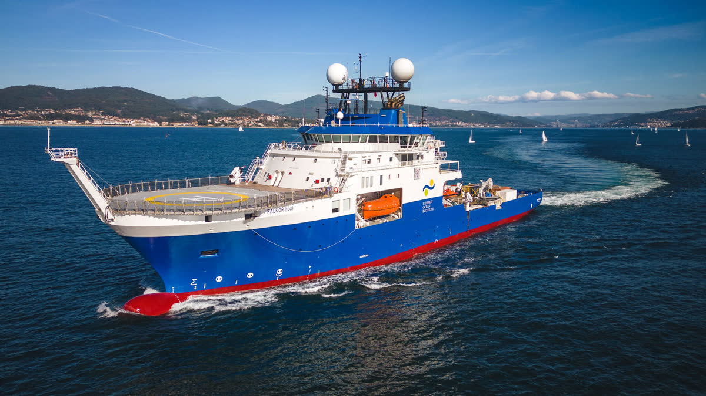
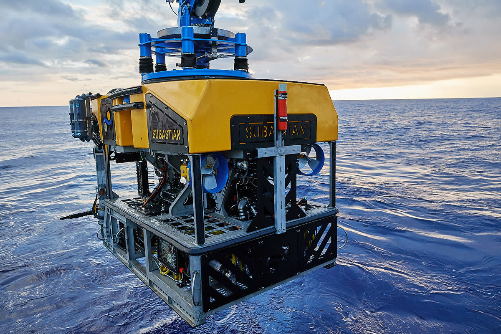

# Research Vessels Image Implementation Plan

## Overview
This plan outlines the steps to add images for the primary vessel and ROV substation to the `research_vessels_slide.html` page.

## Current State Analysis
- **Primary Vessel**: Text-only info box with vessel specifications
- **ROV Substation**: Text-only info box with ROV specifications
- **Available Images**:
  - `falkortoo.jpg`: Research vessel image (already used as map marker)
  - `rov.jpg`: ROV image (not currently used)

## Design Approach

### 1. Layout Structure
The current layout uses a 2-column grid for vessel info. We'll enhance each info box to include:
- Image container at the top
- Existing text information below
- Maintain the hover effects and styling

### 2. Image Container Design
```css
.vessel-image-container {
    width: 100%;
    height: 200px;
    margin-bottom: 1rem;
    overflow: hidden;
    border-radius: 8px;
    position: relative;
}

.vessel-image {
    width: 100%;
    height: 100%;
    object-fit: cover;
    transition: transform 0.3s ease;
}
```

### 3. Visual Effects
- Subtle zoom effect on hover
- Glowing border matching the theme
- Semi-transparent overlay for better text readability if needed
- Maintain consistency with existing sci-fi aesthetic

### 4. Responsive Considerations
- Images scale appropriately on mobile devices
- Maintain aspect ratio
- Consider lazy loading for performance

## Implementation Steps

### Step 1: Modify HTML Structure
Add image containers with overlay effects to each info box:
```html
<div class="info-box">
    <div class="vessel-image-container">
        
        <div class="scan-lines"></div>
        <div class="holographic-overlay"></div>
        <div class="data-overlay">
            <span class="data-text">VESSEL ID: RV-DE-001</span>
        </div>
    </div>
    <div class="info-label">Primary Vessel</div>
    <div class="info-value">RV Deep Explorer - Length: 85m, Crew: 45, Max Speed: 15 knots</div>
</div>
```

### Step 2: Add CSS Styling
- Image container styling
- Hover effects
- Responsive breakpoints
- Loading optimization

### Step 3: Enhance Visual Appeal
- Add subtle animations
- Implement glow effects matching the theme
- Consider adding scan-line effects for sci-fi feel

### Step 4: Performance Optimization
- Add loading="lazy" attribute
- Consider image compression
- Implement proper alt text for accessibility

## Technical Specifications

### CSS Additions
```css
/* Image container styling */
.vessel-image-container {
    width: 100%;
    height: 200px;
    margin-bottom: 1rem;
    overflow: hidden;
    border-radius: 8px;
    position: relative;
    border: 1px solid rgba(0, 229, 255, 0.3);
    box-shadow: 0 0 20px rgba(0, 229, 255, 0.1);
}

/* Image styling */
.vessel-image {
    width: 100%;
    height: 100%;
    object-fit: cover;
    transition: transform 0.3s ease, filter 0.3s ease;
    filter: brightness(0.9);
}

/* Hover effects */
.info-box:hover .vessel-image {
    transform: scale(1.05);
    filter: brightness(1);
}

/* Scan lines effect */
.scan-lines {
    position: absolute;
    top: 0;
    left: 0;
    width: 100%;
    height: 100%;
    background: repeating-linear-gradient(
        0deg,
        transparent,
        transparent 2px,
        rgba(0, 229, 255, 0.03) 2px,
        rgba(0, 229, 255, 0.03) 4px
    );
    pointer-events: none;
    animation: scan 8s linear infinite;
}

@keyframes scan {
    0% { transform: translateY(0); }
    100% { transform: translateY(10px); }
}

/* Holographic overlay */
.holographic-overlay {
    position: absolute;
    top: 0;
    left: 0;
    width: 100%;
    height: 100%;
    background: linear-gradient(
        45deg,
        transparent 30%,
        rgba(0, 229, 255, 0.1) 50%,
        transparent 70%
    );
    animation: holographic 3s ease-in-out infinite;
    pointer-events: none;
}

@keyframes holographic {
    0% { transform: translateX(-100%); }
    100% { transform: translateX(100%); }
}

/* Data overlay */
.data-overlay {
    position: absolute;
    bottom: 10px;
    left: 10px;
    background: rgba(0, 0, 0, 0.8);
    padding: 5px 10px;
    border: 1px solid rgba(0, 229, 255, 0.5);
    border-radius: 4px;
    opacity: 0;
    transition: opacity 0.3s ease;
}

.info-box:hover .data-overlay {
    opacity: 1;
}

.data-text {
    font-family: 'JetBrains Mono', monospace;
    font-size: 0.7rem;
    color: #00E5FF;
    text-transform: uppercase;
    letter-spacing: 1px;
}

/* Glitch effect on hover */
.info-box:hover .vessel-image {
    animation: glitch 0.3s ease-in-out;
}

@keyframes glitch {
    0%, 100% {
        filter: brightness(1) hue-rotate(0deg);
    }
    20% {
        filter: brightness(1.2) hue-rotate(5deg);
        transform: scale(1.05) translateX(2px);
    }
    40% {
        filter: brightness(0.9) hue-rotate(-5deg);
        transform: scale(1.05) translateX(-2px);
    }
    60% {
        filter: brightness(1.1) hue-rotate(2deg);
        transform: scale(1.05) translateY(1px);
    }
}

/* Responsive adjustments */
@media (max-width: 768px) {
    .vessel-image-container {
        height: 150px;
    }
}
```

## Testing Checklist
- [ ] Images display correctly in both info boxes
- [ ] Hover effects work smoothly
- [ ] Layout remains intact on different screen sizes
- [ ] Images load efficiently
- [ ] Accessibility features (alt text) are in place
- [ ] Visual consistency with overall theme maintained

## Visual Effects Implementation

### 1. Scan Lines Effect
- Animated horizontal lines that move vertically across the image
- Creates a retro-futuristic scanner appearance
- Subtle transparency to not obscure the image

### 2. Holographic Overlay
- Diagonal light sweep effect
- Simulates holographic projection
- Activates periodically for dynamic visual interest

### 3. Data Overlay
- Shows vessel/ROV identification codes
- Appears on hover with smooth transition
- Styled like a HUD (Heads-Up Display) element

### 4. Glitch Effect
- Brief distortion effect on hover
- Adds to the high-tech, slightly unstable deep-sea transmission feel
- Combines color shifts and position changes

### 5. Additional Effects to Consider
- Pulsing border glow synchronized with scan lines
- Static noise overlay for "signal interference"
- Depth gauge animation showing current depth
- Sonar ping animation radiating from images
- Terminal-style text typing effect for data overlays

## Enhanced HTML Structure for ROV
```html
<div class="info-box">
    <div class="vessel-image-container">
        
        <div class="scan-lines"></div>
        <div class="holographic-overlay"></div>
        <div class="data-overlay">
            <span class="data-text">ROV ID: SUB-6K-DEEP</span>
        </div>
        <div class="depth-indicator">
            <span class="depth-text">DEPTH: -6000m</span>
        </div>
    </div>
    <div class="info-label">ROV Substation</div>
    <div class="info-value">Substation ROV - Depth Rating: 6000m, Equipped with HD Cameras and Sensors</div>
</div>
```

## Notes
- The existing `falkortoo.jpg` is already used as a map marker, so we'll reuse it for the vessel info box
- The `rov.jpg` will be perfect for the ROV substation section
- Maintain the existing color scheme: #00E5FF (cyan) for accents
- Keep the mysterious, deep-sea exploration theme consistent